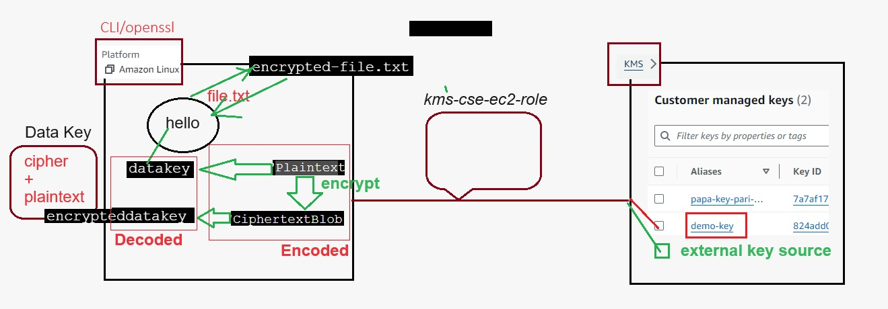

# Securing Data with AWS KMS and OpenSSL on EC2

This project demonstrates how to securely encrypt and decrypt data using AWS Key Management Service (KMS) and OpenSSL on an Amazon EC2 instance. The process involves generating encryption keys with KMS, encrypting data locally on EC2, and safely handling encryption keys to ensure data confidentiality.

## 🎯 Objective

The objective of this practical exercise is to:

- Generate encryption keys using AWS KMS.
- Encrypt and decrypt data using OpenSSL on an EC2 instance.
- Implement best practices for handling and managing encryption keys.

## 📌 Prerequisites

Before you start, ensure you have the following:

- **AWS Account**: Access to an AWS account with permissions to use KMS and EC2.
- **AWS CLI**: Installed and configured on your local machine.
- **OpenSSL**: Installed on the EC2 instance.
- **IAM Role**: An IAM role with KMS access attached to your EC2 instance.
